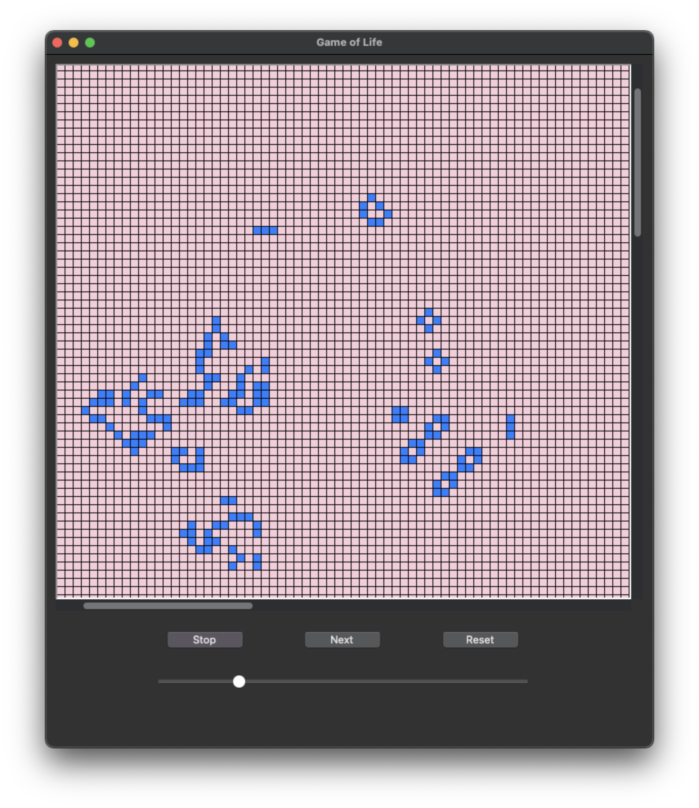

# Conway's Game of Life in Python & tkinter
Just another implementation of [Conway's Game of Life](https://en.wikipedia.org/wiki/Conway%27s_Game_of_Life). Since I had never done a version of this
before, I thought it'd make a fun weekend project, which it was.

Makes use of tkinter's Canvas widget to render cells and provide a way for a user to draw in living cells. 

This is probably not the most optimized implementation you'll find, but it gets the job done pretty decently at small board sizes.

## Possible improvements for the future
It'd be nice to save custom starting positions to replay them later. There's already a starting postions
directory, so just saving the current position on the board as a JSON file and loading it dynamically
ought to be pretty straightforward.
